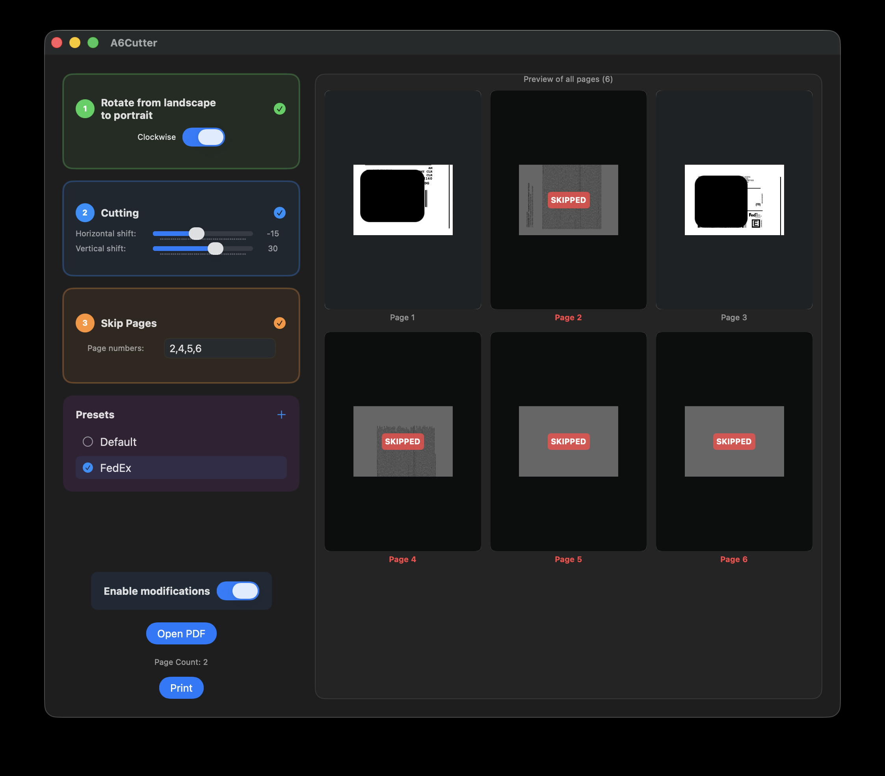

A6Cutter
========

A macOS application for cutting PDF documents into A6-sized tiles with customizable settings and live preview.



## Features

- **PDF Cutting**: Cut A4 landscape PDFs into A6-sized tiles
- **Customizable Settings**: Adjust horizontal and vertical cut shifts
- **Page Rotation**: Rotate landscape pages to portrait before cutting
- **Page Skipping**: Skip specific pages from the output
- **Live Preview**: Real-time preview of all resulting pages
- **Presets**: Save and load custom presets (Default, FedEx, and custom)
- **Print Integration**: Direct printing with filtered pages
- **Multi-language**: English and Czech support

## How to Run

### Development Build
```bash
# Build the application
xcodebuild -scheme A6Cutter -configuration Debug
```


### Permissions
If the app doesn't run due to code signing:
```bash
# Remove quarantine attributes
xattr -d com.apple.quarantine /path/to/A6Cutter.app

# Set execute permissions
chmod +x /path/to/A6Cutter.app/Contents/MacOS/A6Cutter
```

## Usage

1. **Open PDF**: Click "Open PDF" to select your document
2. **Configure Settings**: Adjust rotation, cutting, and skip pages as needed
3. **Preview**: See live preview of all resulting pages
4. **Print**: Use the Print button to print with current settings
5. **Presets**: Save your settings as custom presets for future use

## Keyboard Shortcuts

- `Cmd+O`: Open PDF
- `Cmd+Shift+P`: Print document
- `Enter`: Execute focused button action